# (STEP 22) PROJECT 12 ANSIBLE REFACTORING, ASSIGNMENTS & IMPORTS

## ANSIBLE REFACTORING AND STATIC ASSIGNMENTS (IMPORTS AND ROLES)


In this project you will continue working with *ansible-config-mgt* repository and make some improvements of your code. Now you need to refactor your Ansible code, create assignments, and learn how to use the imports functionality. Imports allow to effectively re-use previously created playbooks in a new playbook – it allows you to organize your tasks and reuse them when needed.


Side Self Study: For better understanding or Ansible artifacts re-use – read this article.

https://docs.ansible.com/ansible/latest/playbook_guide/playbooks_reuse.html


## Code Refactoring
Refactoring is a general term in computer programming. It means making changes to the source code without changing expected behaviour of the software. The main idea of refactoring is to enhance code readability, increase maintainability and extensibility, reduce complexity, add proper comments without affecting the logic.

In your case, you will move things around a little bit in the code, but the overal state of the infrastructure remains the same.

Let us see how you can improve your Ansible code!


## Step 1 – Jenkins job enhancement

Before we begin, let us make some changes to our Jenkins job – now every new change in the codes creates a separate directory which is not very convenient when we want to run some commands from one place. Besides, it consumes space on Jenkins serves with each subsequent change. Let us enhance it by introducing a new Jenkins project/job – we will require Copy Artifact plugin.


1. Go to your *Jenkins-Ansible* server and create a new directory called *ansible-config-artifact* – we will store there all artifacts after each build.

To do this first go to the Server by performing the tasks below.

Click Terminal > New Terminal

On the right side at the bottom click Git bash. The screen below will be displayed.


CD into downloads to confirm the location where the pem key (PBL_All_Projects.pem).

Run `ls`


Run the code below. You will need to repeat the steps below if you turned off your systems.

```
eval `ssh-agent -s`

```

It will show the agent PID


   
     

Now you need to add the private key.

` ssh-add <path-to-private-key>`

Run;

 `ssh-add PBL_All_Projects.pem`


Confirm the key has been added with the command below, you should see the name of your key

 `ssh-add -l`


Now, ssh into your Jenkins-Ansible server using ssh-agent. If connecting for the first time click Yes when prompted.


Run;

`ssh -A ubuntu@public IP address for jenkins-ansible`

`ssh -A ubuntu@3.134.112.165`


We will be able to connect to the Jenkins Ansible server through any instances that we would create as long as the same pem key is used.

Run the command below;

`pwd`

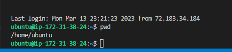

For every build that we created in Project 11, a folder was created. The command below will show all the folders that have been created.

`ls /var/lib/jenkins/jobs/ansible/builds`


In a normal CI/CD , we will quickly use up space if this is left like this as there are several developers who are creating different builds. This project will help us see how we can have less folders.


Now going back to the first step, run the command below to create a new directory called *ansible-config-artifact* 

`sudo mkdir /home/ubuntu/ansible-config-artifact`


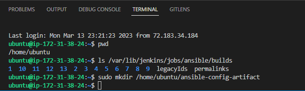

2. Change permissions to this directory, so Jenkins could save files there – 

   `sudo chmod -R 0777 /home/ubuntu/ansible-config-artifact`

   


    We will need to create an explorer page in VSC for the directory we will be working in.

    You can go to file explorer and create a folder for `ansible-config-artifact` under DKWORKSPACE. This will be displayed on the left side under DKWORKSPACE.

   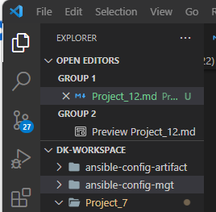

   `cd ansible-config-artifact`

   


3. Go to Jenkins web console -> Manage Jenkins -> Manage Plugins -> on *Available* tab search for *Copy Artifact* and install this plugin without restarting Jenkins

   Login to ansible through the browser. Use your Public IP address for Jenkins_Ansible server.

   http://3.21.170.181:8080

   The screen below will be displayed.


   


   Login with your credentials.

   Username : Project9_Admin

   Password: password

   The screen below will be displayed.

   

   The screen below will be displayed.

   


   Select Copy Artifact and click Install withouth restart.

   

   The screen below will be displayed. It will show that the installation is successful.

   

4. Create a new Freestyle project (you have done it in Project 9) and name it save_artifacts.


   Click Dashboard to Go back.

   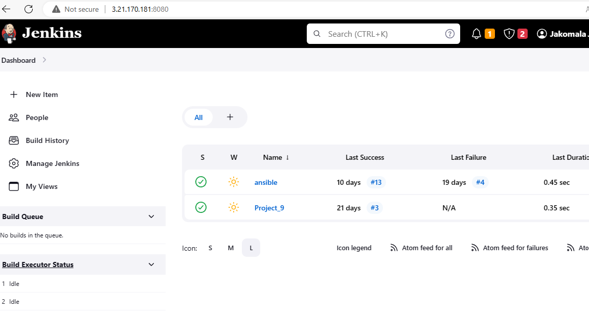

   Click New Item.


      
   

    Enter item name as *save_artifacts*, click on *Frestyle project* and click ok.

    


5. This project will be triggered by completion of your existing ansible project. Configure it accordingly:

   Click on save_artifacts

   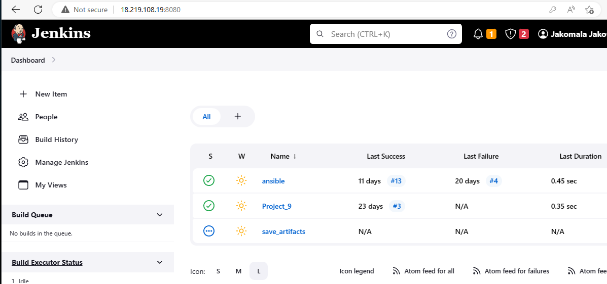

   Click on Configure.

   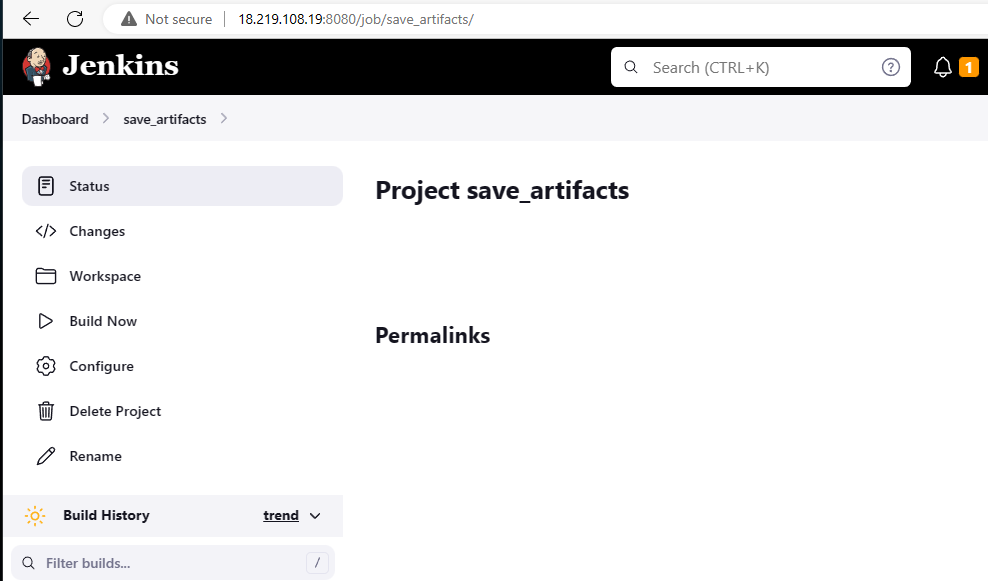

   The General tab will be displayed.

   

   Check discard old builds > Log rotation under strategy > 2 for max number of bulds to keep. This can be whatever you want.

   

   Source Code Management is None > Under Build triggers check Build after other projects are built > Put ansible under project to watch > select trigger only if build is stable

   


   Under Build Steps , select copy artifacts from another project > ansible for project name > ** for artifacts to copy.

   

   Under target directory put /home/ubuntu/ansible-config-artifact

   Click Save

   

   We configured the number of build to 2. This is useful because whenever the jenkins pipeline runs, it creates a directory for the artifacts and it takes alot of space. By specifying the number of build, we can choose to keep only 2 of the latest builds and discard the rest.

6. The main idea of save_artifacts project is to save artifacts into /home/ubuntu/ansible-config-artifact directory. To achieve this, create a Build step and choose Copy artifacts from other project, specify ansible as a source project and /home/ubuntu/ansible-config-artifact as a target directory.

   Click Add build step > Copy artifacts from another project 

   Project name : ansible

   Artifacts to copy: **

   Target Directory: /home/ubuntu/ansible-config-artifact

   Apply then Save

   


7. Test your set up by making some change in README.MD file inside your ansible-config-mgt repository (right inside main branch).


   Login to github

   

   Select ansible-config-mgt

   

   Ensure that you are under the main branch and click on READ.md file

   

   Change the public IP address for Jenkins-ansible server under webhooks if your system has been turned off.

   

   

   Click update webhooks


   Go back under code, click on Edit and make a change at the bottom. I just added : Testing changes for project 12 - March 24, 2023.

   

   Click commit changes

   


   It will show build # 5 and 6 created.

   

   If both Jenkins jobs have completed one after another – you shall see your files inside /home/ubuntu/ansible-config-artifact directory and it will be updated with every commit to your master branch.

   Now your Jenkins pipeline is more neat and clean.

   ## REFACTOR ANSIBLE CODE BY IMPORTING OTHER PLAYBOOKS INTO SITE.YML


   ## Step 2 – Refactor Ansible code by importing other playbooks into site.yml

   Before starting to refactor the codes, ensure that you have pulled down the latest code from master (main) branch, and created a new branch, name it refactor.

   DevOps philosophy implies constant iterative improvement for better efficiency – refactoring is one of the techniques that can be used, but you always have an answer to question "why?". Why do we need to change something if it works well?

   In Project 11 you wrote all tasks in a single playbook common.yml, now it is pretty simple set of instructions for only 2 types of OS, but imagine you have many more tasks and you need to apply this playbook to other servers with different requirements. In this case, you will have to read through the whole playbook to check if all tasks written there are applicable and is there anything that you need to add for certain server/OS families. Very fast it will become a tedious exercise and your playbook will become messy with many commented parts. Your DevOps colleagues will not appreciate such organization of your codes and it will be difficult for them to use your playbook.

   Most Ansible users learn the one-file approach first. However, breaking tasks up into different files is an excellent way to organize complex sets of tasks and reuse them.

Let see code re-use in action by importing other playbooks.

1. Within playbooks folder, create a new file and name it site.yml – This file will now be considered as an entry point into the entire infrastructure configuration. Other playbooks will be included here as a reference. In other words, site.yml will become a parent to all other playbooks that will be developed. Including common.yml that you created previously. 

   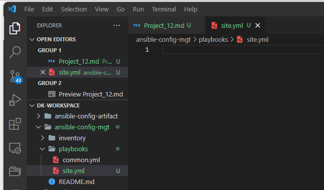

2. Create a new folder in root of the repository and name it static-assignments. The static-assignments folder is where all other children playbooks will be stored. This is merely for easy organization of your work. It is not an Ansible specific concept, therefore you can choose how you want to organize your work. You will see why the folder name has a prefix of static very soon. For now, just follow along.

   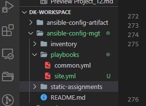

3. Move common.yml file into the newly created static-assignments folder. Just drag and drop the common.yml file into static-assignments.

   

4. Inside site.yml file, import common.yml playbook.

   ```

   ---
   - hosts: all
   - import_playbook: ../static-assignments/common.yml
   ```

   


   The code above uses built in import_playbook Ansible module.

   Your folder structure should look like this;

   ```

   ├── static-assignments
   │   └── common.yml
   ├── inventory
      └── dev
      └── stage
      └── uat
      └── prod
   └── playbooks
      └── site.yml
   ```

   

5. Run ansible-playbook command against the dev environment.

   Since you need to apply some tasks to your dev servers and wireshark is already installed – you can go ahead and create another playbook under static-assignments and name it common-del.yml. In this playbook, configure deletion of wireshark utility.

```
   ---
- name: update web, nfs and db servers
  hosts: webservers, nfs, db
  remote_user: ec2-user
  become: yes
  become_user: root
  tasks:
  - name: delete wireshark
    yum:
      name: wireshark
      state: removed

- name: update LB server
  hosts: lb
  remote_user: ubuntu
  become: yes
  become_user: root
  tasks:
  - name: delete wireshark
    apt:
      name: wireshark-qt
      state: absent
      autoremove: yes
      purge: yes
      autoclean: yes
```


update site.yml with - import_playbook: ../static-assignments/common-del.yml instead of common.yml and run it against dev servers:

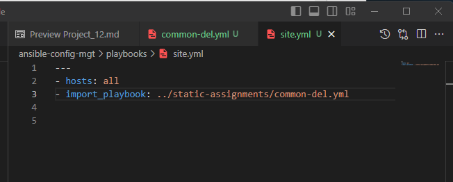


 Ensure that that you are in ansible-config-artifact directory.

 We need to point the ansible configuration file to inventory directory.

 Run `pwd`

 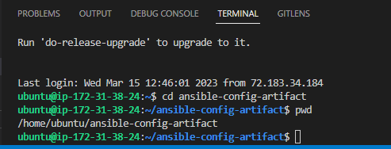

 Run `cd inventory`

 Run `pwd`

 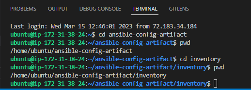

 copy the path as shown below;

 /home/ubuntu/ansible-config-artifact/inventory


 Run 
 `sudo vi /etc/ansible/ansible.cfg`

 The screen below will be displayed.

 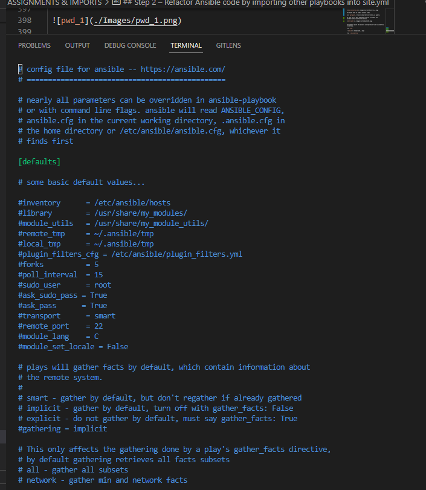


 Use i to insert. Replace what is defaulted under inventory with the path below.

 /home/ubuntu/ansible-config-artifact/inventory

 Then remove the # to uncomment it.

 The save with Esc > :wq!

 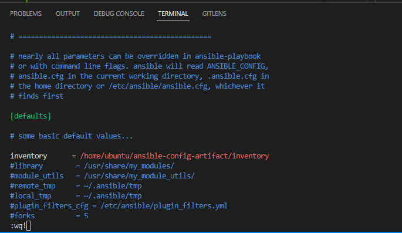


 Check if you can reach the servers.

 `ansible all -m ping`

 The screen below show that servers are reacheable.

 


 Open another Git bash terminal and change directory to ansible-config-mgt.

`cd ansible-config-mgt`


Run `git status`


Run `git pull`


Run `git add .`


Run `git commit -m "Working on Project 12"`


Run `git push`


Go back to the previous Git bash terminal and change directory to  ansible-config-artifacts if you are not there.

 `cd ansible-config-artifact`

 

 Run `ls playbooks`. It will show site.yml file.

 

 Run the ansible playbook below.

 `ansible-playbook -i /home/ubuntu/ansible-config-artifact/inventory/dev.yml /home/ubuntu/ansible-config-artifact/playbooks/site.yml`

 


 The screens below will show that the playbook run successfully.


 

 

 


 Make sure that wireshark is deleted on all the servers by running wireshark --version

Now you have learned how to use import_playbooks module and you have a ready solution to install/delete packages on multiple servers with just one command.

To check and confirm that Wireshark have been deleted, get the private IP fo any of the servers and run the command below to connect to the server. We will use one of the web servers.

`ssh ec2-user@172.31.45.251`


Run `which wireshark`

It will show that there is nop wireshark


You can also run;

`wireshark --version`


exit

We need to create a branch. We should have created it earlier.

- Open a new git bash.

  

- Change directory to ansible-config-mgt.

   `cd ansible-config-mgt`

   

- Run `git status`

   It will show that the branch is upto date.

   

   To create a new branch called refactor, run the command below.

   `git checkout -b refactor`

   


   ## CONFIGURE UAT WEBSERVERS WITH A ROLE ‘WEBSERVER’

   - ## Step 3 – Configure UAT Webservers with a role ‘Webserver’
      We have our nice and clean dev environment, so let us put it aside and configure 2 new Web Servers as uat. We could write tasks to configure Web Servers in the same playbook, but it would be too messy, instead, we will use a dedicated role to make our configuration reusable.

   1. Launch 2 fresh EC2 instances using RHEL 8 image, we will use them as our uat servers, so give them names accordingly – Web1-UAT and Web2-UAT.


      

      Tip: Do not forget to stop EC2 instances that you are not using at the moment to avoid paying extra. For now, you only need 2 new RHEL 8 servers as Web Servers and 1 existing Jenkins-Ansible server up and running.

   2. To create a role, you must create a directory called roles/, relative to the playbook file or in /etc/ansible/ directory.

      There are two ways how you can create this folder structure:

   -  Use an Ansible utility called ansible-galaxy inside ansible-config-mgt/roles directory (you need to create roles directory upfront)

      `mkdir roles`

      `cd roles`

      `ansible-galaxy init webserver`

   - Create the directory/files structure manually.


   *Note*: You can choose either way, but since you store all your codes in GitHub, it is recommended to create folders and files there rather than locally on Jenkins-Ansible server.

   The entire folder structure should look like below, but if you create it manually – you can skip creating tests, files, and vars or remove them if you used ansible-galaxy.

   

   In our case we will create the folders manually as shown below.

   

3. Update your inventory ansible-config-mgt/inventory/uat.yml file with IP addresses of your 2 UAT Web servers

   NOTE: Ensure you are using ssh-agent to ssh into the Jenkins-Ansible instance just as you have done in project 11;

   Note the 2 Private IP addresses for the web servers;

   Web1-UAT - 172.31.8.180
   Web2-UAT - 172.31.6.179

   ```
   [uat-webservers]
   <Web1-UAT-Server-Private-IP-Address> ansible_ssh_user='ec2-user' 

   <Web2-UAT-Server-Private-IP-Address> ansible_ssh_user='ec2-user'
   ```

   After replacing the the IP addresses, it will look like this below;

   ```
   [uat-webservers]
   172.31.8.180 ansible_ssh_user='ec2-user' 

   172.31.6.179 ansible_ssh_user='ec2-user' 
   ```

   Click on uat.yml under inventory folder.

   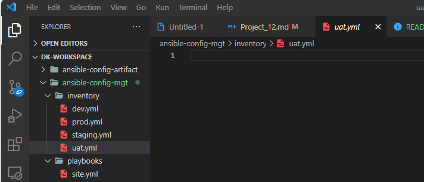

   Input the uat servers information mentioned above to uat.yml.

   

4. In /etc/ansible/ansible.cfg file uncomment roles_path string and provide a full path to your roles directory roles_path    = /home/ubuntu/ansible-config-artifact/roles, so Ansible could know where to find configured roles.

   Run the command below under the ansible-config-artifact directory.

   `sudo vi /etc/ansible/ansible.cfg`

   

   Scroll to roles_path string and uncomment it and provide a fule path to the roles directory. Click i for insert and look for it.

   

   

   Save and exit by;

   Esc > :wq!


5. It is time to start adding some logic to the webserver role. Go into tasks directory, and within the main.yml file, start writing configuration tasks to do the following:

- Install and configure Apache (httpd service)
- Clone Tooling website from GitHub https://github.com/<your-name>/tooling.git.
- Ensure the tooling website code is deployed to /var/www/html on each of 2 UAT Web servers.
- Make sure httpd service is started

Your main.yml may consist of following tasks:

```
---
- name: install apache
  become: true
  ansible.builtin.yum:
    name: "httpd"
    state: present

- name: install git
  become: true
  ansible.builtin.yum:
    name: "git"
    state: present

- name: clone a repo
  become: true
  ansible.builtin.git:
    repo: https://github.com/<your-name>/tooling.git
    dest: /var/www/html
    force: yes

- name: copy html content to one level up
  become: true
  command: cp -r /var/www/html/html/ /var/www/

- name: Start service httpd, if not started
  become: true
  ansible.builtin.service:
    name: httpd
    state: started

- name: recursively remove /var/www/html/html/ directory
  become: true
  ansible.builtin.file:
    path: /var/www/html/html
    state: absent
```

replace the relevant information as shown below.

```
---
- name: install apache
  become: true
  ansible.builtin.yum:
    name: "httpd"
    state: present

- name: install git
  become: true
  ansible.builtin.yum:
    name: "git"
    state: present

- name: clone a repo
  become: true
  ansible.builtin.git:
    repo: https://github.com/MKDKSZAKOLWA/tooling.git
    dest: /var/www/html
    force: yes

- name: copy html content to one level up
  become: true
  command: cp -r /var/www/html/html/ /var/www/

- name: Start service httpd, if not started
  become: true
  ansible.builtin.service:
    name: httpd
    state: started

- name: recursively remove /var/www/html/html/ directory
  become: true
  ansible.builtin.file:
    path: /var/www/html/html
    state: absent
```

Copy it to main.yml under tasks folder.


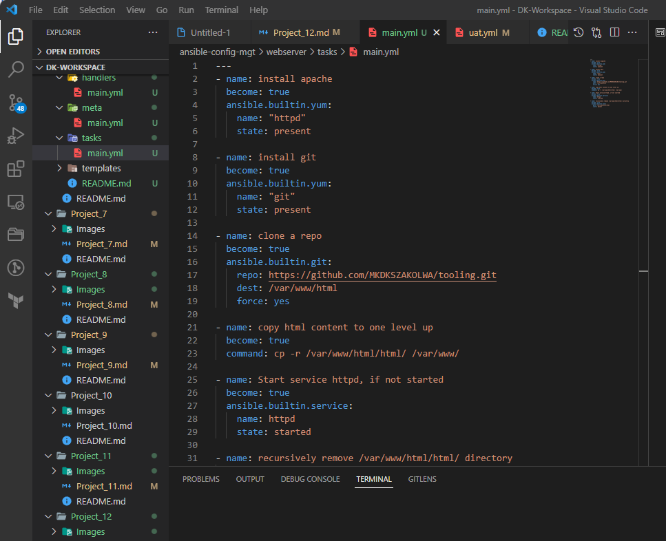

## REFERENCE WEBSERVER ROLE

   ## Step 4 – Reference ‘Webserver’ role

Within the static-assignments folder, create a new assignment for uat-webservers uat-webservers.yml. This is where you will reference the role.

```
---
- hosts: uat-webservers
  roles:
     - webserver
```

Remember that the entry point to our ansible configuration is the site.yml file. Therefore, you need to refer your uat-webservers.yml role inside site.yml.

So, we should have this in site.yml

```
---
- hosts: all
- import_playbook: ../static-assignments/common-del.yml

- hosts: uat-webservers
- import_playbook: ../static-assignments/uat-webservers.yml
```

To do this click on sit.yml.


Copy the uat-webservers.yml role inside site.yml.


## Step 5 – Commit & Test

Commit your changes, create a Pull Request and merge them to master branch, make sure webhook triggered two consequent Jenkins jobs, they ran successfully and copied all the files to your Jenkins-Ansible server into /home/ubuntu/ansible-config-mgt/ directory.

- Run `git status`. Make sure you are on the refactor branch.

   

   Glick the Source Control on the left and click commit.

   


Switch branch ;

`git switch main`

   Run `git pull`


Run `git add .`


Run `git commit -m "Making changes on Project 12"`


Run `git push`


Now run the playbook against your uat inventory and see what happens:

`ansible-playbook -i /home/ubuntu/ansible-config-artifact/inventory/uat.yml /home/ubuntu/ansible-config-artifact/playbooks/site.yml`

The screens below will be displayed.


You should be able to see both of your UAT Web servers configured and you can try to reach them from your browser:

`http://<Web1-UAT-Server-Public-IP-or-Public-DNS-Name>/index.php`

`http://18.218.157.10/index.php`


or

`http://<Web1-UAT-Server-Public-IP-or-Public-DNS-Name>/index.php`

`http://18.216.15.225/index.php`


Your Ansible architecture now looks like this:


 


